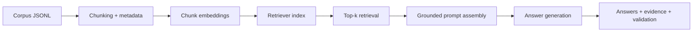

# 03. Retrieval-Augmented Generation and Knowledge-Intensive Workflows on LUMI-G

This lesson is the first end-to-end application pattern in the extension track: build a grounded RAG workflow over a document corpus.

## What This Lesson Enables

Run a complete RAG pipeline that:

- ingests a corpus
- chunks documents with stable IDs
- generates embeddings
- builds a retrievable index
- retrieves top-k evidence
- generates grounded answers
- validates output consistency

## When To Use This Workflow

Use this workflow when:

- answers must be grounded in a changing corpus
- full model fine-tuning is unnecessary
- you need evidence-aware outputs with traceable sources

Do not use this lesson as:

- an online serving architecture guide
- a production vector database operations guide
- a full evaluation science tutorial

## Prerequisites

- Working LUMI account and LUMI-G access
- AI Factory container environment configured (`CONTAINER` in `env.sh`)
- Familiarity with onboarding lessons
- Preferred: completion of extension Lessons 1 and 2

## Workflow At A Glance



## Minimal Working Example

Work from:

```bash
cd /path/to/LUMI-AI-Guide/extension-track/03-rag-and-knowledge-workflows
```

1. Prepare sample corpus and query set:

```bash
python scripts/prepare_corpus.py --output data
```

2. Run chunking:

```bash
python scripts/chunk_corpus.py --config configs/rag.yaml
```

3. Embed chunks:

```bash
python scripts/embed_chunks.py --config configs/rag.yaml
```

4. Build retriever index:

```bash
python scripts/build_index.py --config configs/rag.yaml
```

5. Retrieve and generate grounded answers:

```bash
python scripts/answer_queries.py --config configs/rag.yaml
```

6. Validate run artifacts:

```bash
python scripts/validate_rag_run.py --config configs/rag.yaml
```

7. Canonical LUMI run:

```bash
sbatch jobs/run_rag_single_node.sh
```

## How To Verify It Worked

Check all of these:

- `chunks.jsonl` exists with non-empty chunk set
- `embeddings.jsonl` has one embedding per chunk
- `retriever_index.npz` exists and loads
- `retrieval_results.jsonl` has one record per query
- `answers.jsonl` contains `answer` and `evidence_chunk_ids`
- validation prints `VALIDATION_OK=1`

Expected outputs: [assets/expected-output-tree.txt](assets/expected-output-tree.txt)  
Schemas: [data/expected-schema.md](data/expected-schema.md)

## Why This Works On LUMI-G

- LUMI-G provides MI250X GPUs suitable for embedding and generation steps.
- Software commonly sees 8 GPU/GCD devices per node; always verify GPU visibility in logs.
- In this baseline lesson, retrieval/index steps stay lightweight and simple.

## Data And Storage Considerations

- First run is intentionally local to lesson paths.
- Preserve stable IDs and metadata from corpus through final answers.
- For team sharing or staging larger corpora, LUMI-O S3-style workflows are a natural extension.
- Dataset as a Service can be treated as a future managed-dataset extension point.

## Common Failure Modes

See [troubleshooting/common-failures.md](troubleshooting/common-failures.md).

## How To Extend

After baseline success:

- change chunk size and overlap
- change retrieval `top_k`
- swap embedding model
- add metadata-based retrieval filters
- compare retrieved-context-only outputs against generated answers
- stage corpus and outputs in LUMI-O for sharing

## Operational Checklist

- Corpus schema validated
- Stable IDs preserved for docs/chunks/queries
- Chunk manifest created
- Embeddings complete and aligned with chunk IDs
- Retriever index built
- Retrieval results saved for every query
- Answers include evidence chunk IDs
- Validation passes with consistent counts

## Next Lesson

Natural next step: evaluation, benchmarking, and trustworthiness for customer AI workflows.
