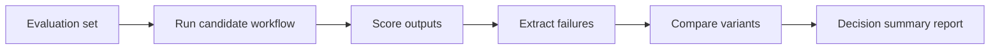

# 04. Evaluation, Benchmarking, and Trustworthiness for Customer AI Workflows on LUMI-G

This lesson teaches the first system-level quality pattern in the extension track: evaluate whether a workflow is good enough for customer use.

## What This Lesson Enables

Run a repeatable evaluation pipeline that:

- executes a baseline and a controlled variant
- scores outputs with a compact metric set
- extracts structured failure cases
- produces a decision-oriented report

## When To Use This Workflow

Use this lesson when:

- you already have a baseline AI workflow (for example Lesson 3 RAG)
- stakeholders need evidence of quality and reliability
- you must compare two variants before adopting one

Do not use this lesson as:

- a full governance/compliance framework
- a large-scale red-teaming program
- production observability architecture

## Prerequisites

- Working LUMI access and AI Factory container setup
- Completion of onboarding guide
- Preferred: completion of extension Lessons 1–3
- Access to this repository and sample evaluation set

## Workflow At A Glance



## Minimal Working Example

Work from:

```bash
cd /path/to/LUMI-AI-Guide/extension-track/04-evaluation-and-trustworthiness
```

1. Run baseline variant:

```bash
python scripts/run_baseline_eval.py --config configs/eval.yaml --variant baseline
```

2. Run candidate variant:

```bash
python scripts/run_baseline_eval.py --config configs/eval.yaml --variant candidate
```

3. Score both variants:

```bash
python scripts/score_outputs.py --config configs/eval.yaml --variant baseline
python scripts/score_outputs.py --config configs/eval.yaml --variant candidate
```

4. Extract failure samples:

```bash
python scripts/extract_failures.py --config configs/eval.yaml --variant baseline
python scripts/extract_failures.py --config configs/eval.yaml --variant candidate
```

5. Compare and report:

```bash
python scripts/compare_variants.py --config configs/eval.yaml
python scripts/build_report.py --config configs/eval.yaml
```

6. Canonical Slurm run:

```bash
sbatch jobs/run_eval_single_node.sh
```

## How To Verify It Worked

Check all of these:

- evaluated record count equals evaluation set size
- scored records exist for both variants
- failure sample files are non-empty (unless all pass)
- comparison artifact contains metric deltas
- final markdown report exists with recommendation

See [assets/expected-output-tree.txt](assets/expected-output-tree.txt).

## What To Measure And Why

This lesson uses a minimal scorecard:

- retrieval hit rate (did evidence match expected source?)
- answer score (keyword/rubric overlap)
- grounded rate (answer + evidence consistency proxy)
- completion rate (non-empty outputs)

This is intentionally small and operational.

## Failure Analysis

Failure categories used in this lesson:

- retrieved_wrong_document
- correct_evidence_answer_wrong
- answer_unsupported_by_evidence
- answer_incomplete
- output_missing_or_empty

## Comparing Two Variants

Default controlled comparison:

- baseline `top_k=3`
- candidate `top_k=5`

You can change one factor at a time in `configs/eval.yaml`.

## Common Failure Modes

See [troubleshooting/common-failures.md](troubleshooting/common-failures.md).

## Operational Checklist

- evaluation set versioned
- IDs preserved end-to-end
- scoring deterministic
- output count checked
- sample failures reviewed
- comparison condition documented
- summary report saved

## Next Lesson

Suggested next step: synthetic data and data-centric AI workflows on LUMI-G.

