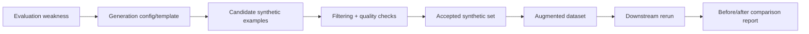

# 05. Synthetic Data and Data-Centric AI Workflows on LUMI-G

This lesson teaches a closed-loop improvement pattern: use measured weaknesses to generate targeted synthetic data, filter it, and verify downstream impact.

## What This Lesson Enables

Run a complete data-centric improvement loop:

- identify weak cases from evaluation
- generate synthetic candidates
- filter and curate accepted examples
- build an augmented dataset with provenance
- rerun downstream evaluation
- compare baseline vs augmented results

## When To Use This Workflow

Use this workflow when:

- evaluation reveals sparse or missing task coverage
- real labeled examples are limited or slow to collect
- generated examples can be validated with clear checks

Do not use this workflow when:

- only authoritative real-world labels are acceptable
- synthetic outputs cannot be validated
- the root issue is infrastructure or retrieval bugs, not data gaps

## Prerequisites

- Working LUMI access and AI Factory container setup
- Completion of onboarding lessons
- Preferred: completion of extension Lesson 4
- Access to this repository and weak-case inputs

## Workflow At A Glance



## Minimal Working Example

Work from:

```bash
cd /path/to/LUMI-AI-Guide/extension-track/05-synthetic-data-and-data-centric-workflows
```

1. Identify weak cases:

```bash
python scripts/identify_weak_cases.py --generate-config configs/generate.yaml
```

2. Generate synthetic candidates:

```bash
python scripts/generate_candidates.py --generate-config configs/generate.yaml
```

3. Filter and curate:

```bash
python scripts/filter_candidates.py --generate-config configs/generate.yaml --filter-config configs/filter.yaml
```

4. Build augmented dataset:

```bash
python scripts/merge_augmented_dataset.py --generate-config configs/generate.yaml --filter-config configs/filter.yaml
```

5. Rerun downstream task and compare:

```bash
python scripts/rerun_downstream_task.py --generate-config configs/generate.yaml --compare-config configs/compare.yaml
python scripts/compare_results.py --generate-config configs/generate.yaml --compare-config configs/compare.yaml
```

6. Canonical Slurm run:

```bash
sbatch jobs/run_synthdata_single_node.sh
```

## How To Verify It Worked

Confirm all of these:

- candidate file exists and has expected count
- filtering writes accepted/rejected counts
- augmented dataset is saved and version-tagged
- rerun results exist for baseline and augmented variants
- comparison report exists with deltas and recommendation

Expected artifact layout: [assets/expected-output-tree.txt](assets/expected-output-tree.txt)

## What Makes Synthetic Data Useful

Useful synthetic data in this lesson is:

- targeted to measured weakness
- validated by explicit filters
- traceable with provenance fields
- separable from original data
- evaluated by downstream effect, not volume alone

## Filtering And Quality Control

Main checks:

- schema validation
- deduplication against baseline and accepted set
- required-term/support checks
- explicit accept/reject status with reasons
- provenance retention from weak case to accepted record

## Comparing Baseline And Augmented Workflows

This lesson includes one controlled comparison:

- baseline dataset
- augmented dataset (baseline + accepted synthetic)

The report compares:

- weak-case coverage rate
- average case score
- per-case improvement/failure persistence

## Common Failure Modes

See [troubleshooting/common-failures.md](troubleshooting/common-failures.md).

## Operational Checklist

- weak-case set defined and versioned
- generation config versioned
- candidate pool saved
- filters documented and executed
- augmented dataset versioned
- rerun completed for baseline and augmented
- comparison report saved

## Next Lesson

Suggested next step: topology-aware scaling of advanced AI workloads on LUMI-G.

