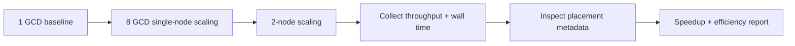

# 06. Topology-Aware Scaling of Advanced AI Workloads on LUMI-G

This lesson teaches scaling as a mapping experiment: rank placement, device usage, and communication must match MI250X node topology to improve throughput.

## What This Lesson Enables

Run a controlled scaling ladder and compare results:

- 1 GCD baseline
- 8 GCD single-node run
- small multi-node run
- placement inspection and throughput/efficiency comparison

## When To Use This Workflow

Use this workflow when:

- one-device throughput is insufficient
- workload size justifies multi-device or multi-node runs
- you need evidence that scaling improves useful throughput

Do not use this workflow when:

- workload is too small to amortize communication
- bottleneck is storage or input pipeline, not compute
- baseline single-device run is not yet stable

## Prerequisites

- Working LUMI access and AI Factory container setup
- Completion of onboarding guide
- Preferred: completion of extension Lessons 1 and 2
- Access to this repository and baseline workload scripts

## Workflow At A Glance



## Minimal Working Example

Work from:

```bash
cd /path/to/LUMI-AI-Guide/extension-track/06-topology-aware-scaling
```

1. Baseline run:

```bash
sbatch jobs/run_1gcd.sh
```

2. Single-node scaling run:

```bash
sbatch jobs/run_8gcd_single_node.sh
```

3. Multi-node scaling run:

```bash
sbatch jobs/run_multi_node.sh
```

4. Compare scaling records:

```bash
python scripts/compare_scaling.py --compare-config configs/compare.yaml
```

## How To Verify It Worked

Confirm all of these:

- intended GPU count is visible in run metadata
- rank count matches expected world size
- placement metadata files exist
- per-run summary (`run_summary.json`) exists for each configuration
- comparison report contains speedup and efficiency fields

Expected outputs: [assets/expected-output-tree.txt](assets/expected-output-tree.txt)

## LUMI-G Topology That Matters

This lesson is built around these practical facts:

- one LUMI-G node appears as 8 GPU-visible GCD devices
- CPU side has 4 NUMA domains
- GPU numbering does not map trivially to NUMA numbering
- placement and binding choices affect scaling outcomes

## Binding And Distribution Choices

Default pattern in this lesson:

- exclusive node allocation
- explicit rank launch via `torchrun`
- explicit Slurm distribution and CPU binding for scaled runs

Then compare against baseline with the same effective workload assumptions.

## Measuring Scaling

This lesson uses a compact scorecard:

- wall time
- throughput (samples/sec)
- relative speedup vs baseline
- scaling efficiency

## Comparing Configurations

The default controlled comparison is:

- 1 node × 1 GCD
- 1 node × 8 GCD
- 2 nodes × 8 GCD per node

Interpret gains relative to communication overhead and workload size.

## Common Failure Modes

See [troubleshooting/common-failures.md](troubleshooting/common-failures.md).

## Operational Checklist

- baseline run established
- GPU/rank counts validated
- binding/distribution settings captured
- effective workload documented
- per-run summaries collected
- scaling report saved

## Next Lesson

Suggested next step: advanced inference and serving patterns on LUMI-G.

