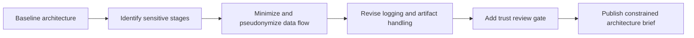

# 09. Data Protection, Sensitive Data, and Trustworthy AI Operations on LUMI AI Factory

This lesson is the first post-capstone operational extension. It shows how to redesign a baseline AI Factory workflow when sensitive data or higher trust requirements are present.

## What This Lesson Enables

Adapt an existing architecture into a constrained, safer operational pattern by:

- identifying sensitive workflow stages
- reducing data exposure across artifacts and logs
- applying pseudonymization/minimization patterns
- adding an explicit trust review gate
- updating the architecture brief for governed pilot use

## When This Workflow Is Needed

Use this lesson when your AI workflow touches:

- personal data or identifying attributes
- restricted internal corpora
- customer-confidential documents
- outputs that require stronger review before use

## What You Need Before Starting

- completion of main extension track (especially Lessons 3, 4, and 8)
- one baseline architecture to modify
- familiarity with AI Factory execution environment on LUMI

## Workflow At A Glance



## Minimal Worked Example

This lesson provides one baseline pattern and one sensitive-data redesign:

- [Baseline architecture](/Users/anisrahm/Documents/LUMI-AI-Guide/extension-track/09-sensitive-data-and-trustworthy-operations/worked-example/baseline-architecture.md)
- [Sensitive-data variant](/Users/anisrahm/Documents/LUMI-AI-Guide/extension-track/09-sensitive-data-and-trustworthy-operations/worked-example/sensitive-data-variant.md)
- [Data-flow map](/Users/anisrahm/Documents/LUMI-AI-Guide/extension-track/09-sensitive-data-and-trustworthy-operations/worked-example/data-flow-map.md)

Use templates:

- [Data classification table](/Users/anisrahm/Documents/LUMI-AI-Guide/extension-track/09-sensitive-data-and-trustworthy-operations/templates/data-classification-table.md)
- [Trust gate template](/Users/anisrahm/Documents/LUMI-AI-Guide/extension-track/09-sensitive-data-and-trustworthy-operations/templates/trust-gate-template.md)
- [Revised architecture brief](/Users/anisrahm/Documents/LUMI-AI-Guide/extension-track/09-sensitive-data-and-trustworthy-operations/templates/revised-architecture-brief.md)

## How To Verify It Worked

A successful redesign should show:

- fewer data-bearing artifacts than baseline
- explicit sensitivity classification by stage
- separated identifiers vs content where possible
- reduced logging footprint
- review gate defined before downstream consumption

Use:

- [Trust checklist](/Users/anisrahm/Documents/LUMI-AI-Guide/extension-track/09-sensitive-data-and-trustworthy-operations/assets/trust-checklist.md)
- [Brief validator](/Users/anisrahm/Documents/LUMI-AI-Guide/extension-track/09-sensitive-data-and-trustworthy-operations/assets/validate_revised_brief.py)

Example:

```bash
python assets/validate_revised_brief.py \
  --brief /path/to/your/revised-architecture-brief.md
```

## Data Minimization And Pseudonymization

Apply these defaults:

- remove non-essential fields before model-facing stages
- replace direct identifiers with stable pseudonymous IDs
- keep lookup tables separate from inference artifacts
- avoid raw sensitive content in routine logs

## Trustworthiness Gate

Use one explicit gate before expansion:

- sample output review for risky classes
- unsupported-answer and leakage checks
- approval decision with recorded owner and date

Template:

- [Trust gate template](/Users/anisrahm/Documents/LUMI-AI-Guide/extension-track/09-sensitive-data-and-trustworthy-operations/templates/trust-gate-template.md)

## Common Failure Modes

See [common-failures.md](/Users/anisrahm/Documents/LUMI-AI-Guide/extension-track/09-sensitive-data-and-trustworthy-operations/troubleshooting/common-failures.md).

## Operational Checklist

- sensitive stages identified
- unnecessary fields removed
- pseudonymous IDs applied where possible
- logging scope minimized and documented
- trust gate defined and owned
- revised architecture brief completed

## Next Lesson

Suggested next step: MLOps and lifecycle management for AI Factory workflows.

