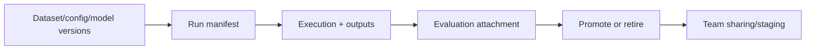

# 10. MLOps and Lifecycle Management for AI Factory Workflows

This lesson teaches how to manage AI Factory workflows as reusable team assets, not one-off successful runs.

## What This Lesson Enables

Package one workflow into a reproducible lifecycle with:

- versioned dataset/config/model references
- run manifests and evaluation links
- clear experiment vs promoted artifact states
- shareable storage path for team handoff

## When To Use This Workflow

Use this lesson when:

- multiple team members work on the same workflow
- repeated experiments must stay comparable
- artifacts are accumulating and hard to trace
- a prototype is moving toward a managed asset

## What You Need Before Starting

- completion of onboarding guide
- preferred completion of Lessons 3, 4, and 8
- one existing workflow artifact set to organize
- optional access to LUMI-O for sharing/staging

## Workflow At A Glance



## Minimal Worked Example

This lesson includes:

- [baseline experiment](/Users/anisrahm/Documents/LUMI-AI-Guide/extension-track/10-mlops-and-lifecycle-management/worked-example/baseline-experiment.md)
- [promoted version](/Users/anisrahm/Documents/LUMI-AI-Guide/extension-track/10-mlops-and-lifecycle-management/worked-example/promoted-version.md)
- [shareable artifacts plan](/Users/anisrahm/Documents/LUMI-AI-Guide/extension-track/10-mlops-and-lifecycle-management/worked-example/shareable-artifacts.md)

Core templates:

- [run manifest](/Users/anisrahm/Documents/LUMI-AI-Guide/extension-track/10-mlops-and-lifecycle-management/templates/run-manifest.yaml)
- [artifact layout](/Users/anisrahm/Documents/LUMI-AI-Guide/extension-track/10-mlops-and-lifecycle-management/templates/artifact-layout.md)
- [promotion checklist](/Users/anisrahm/Documents/LUMI-AI-Guide/extension-track/10-mlops-and-lifecycle-management/templates/promotion-checklist.md)
- [lifecycle states](/Users/anisrahm/Documents/LUMI-AI-Guide/extension-track/10-mlops-and-lifecycle-management/templates/lifecycle-states.md)

Supporting assets:

- [naming cheat sheet](/Users/anisrahm/Documents/LUMI-AI-Guide/extension-track/10-mlops-and-lifecycle-management/assets/naming-cheatsheet.md)
- [lifecycle checklist](/Users/anisrahm/Documents/LUMI-AI-Guide/extension-track/10-mlops-and-lifecycle-management/assets/lifecycle-checklist.md)

## How To Verify It Worked

Confirm all of these:

- each run has a complete manifest
- each promoted artifact links back to one source run
- dataset/config/model provenance is present
- experiment and promoted paths are clearly separated
- sharing path and owner are documented

Example checks:

```bash
python scripts/validate_manifest.py --manifest templates/run-manifest.yaml
python scripts/build_run_summary.py --manifest templates/run-manifest.yaml
```

## What To Version And Why

Minimum required:

- dataset version
- config version
- model/adapter reference
- container/environment reference
- run metadata
- evaluation result
- promotion decision and reviewer

## Artifact Layout And Storage Pattern

- active workspace: draft experiments and intermediate outputs
- promoted area: reviewed artifacts with stable IDs
- LUMI-O (optional): team sharing/staging for promoted deliverables

Use strict naming and directory conventions to avoid mystery runs.

## LUMI Platform Notes For Lifecycle Work

- keep runtime references pinned to an AI Software Environment container
- use LUMI-O selectively for sharing or staging promoted artifacts
- avoid broad recomputation because allocations are billed by compute usage

## Promotion And Retirement Rules

A workflow version is promoted only when:

- evaluation is attached
- provenance fields are complete
- intended use and limitations are documented

Versions failing relevance or quality checks should be retired/archived, not left as ambiguous "final" outputs.

## Common Failure Modes

See [common-failures.md](/Users/anisrahm/Documents/LUMI-AI-Guide/extension-track/10-mlops-and-lifecycle-management/troubleshooting/common-failures.md).

## Operational Checklist

- run manifest present
- dataset/config/model/env versions recorded
- evaluation attached
- promotion state clear
- share/storage path chosen
- ownership and review date assigned

## Next Lesson

Suggested next step: team operating models and collaboration patterns for AI Factory projects.
