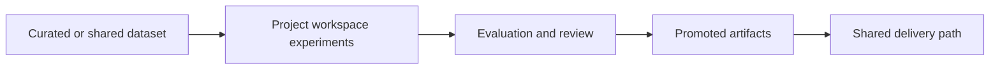

# 11. Team Operating Models and Collaboration Patterns for AI Factory Projects

This lesson teaches how to run AI Factory workflows as a team system with clear ownership, review, sharing, and handoff practices.

## What This Lesson Enables

Build a reusable collaboration blueprint for a multi-person AI project with:

- explicit role ownership
- stable artifact boundaries
- clear dataset source-of-truth rules
- review gates tied to promotion
- handoff requirements for downstream teams

## When This Workflow Is Needed

Use this lesson when:

- multiple contributors are working in parallel
- datasets and benchmark artifacts are shared across roles
- promoted outputs must be reviewed and handed off cleanly
- cross-project collaboration is expected

## What You Need Before Starting

- completion of Lesson 10 lifecycle practices
- one prior workflow to team-operationalize (RAG or inference recommended)
- access to LUMI project workspace and optional LUMI-O sharing path

## Workflow At A Glance



## Minimal Worked Example

This lesson includes:

- [project scenario](/Users/anisrahm/Documents/LUMI-AI-Guide/extension-track/11-team-operating-models-and-collaboration/worked-example/project-scenario.md)
- [collaboration pattern](/Users/anisrahm/Documents/LUMI-AI-Guide/extension-track/11-team-operating-models-and-collaboration/worked-example/collaboration-pattern.md)
- [sharing model](/Users/anisrahm/Documents/LUMI-AI-Guide/extension-track/11-team-operating-models-and-collaboration/worked-example/sharing-model.md)

Core templates:

- [team operating model](/Users/anisrahm/Documents/LUMI-AI-Guide/extension-track/11-team-operating-models-and-collaboration/templates/team-operating-model.md)
- [responsibility matrix](/Users/anisrahm/Documents/LUMI-AI-Guide/extension-track/11-team-operating-models-and-collaboration/templates/responsibility-matrix.md)
- [artifact flow map](/Users/anisrahm/Documents/LUMI-AI-Guide/extension-track/11-team-operating-models-and-collaboration/templates/artifact-flow-map.md)
- [handoff checklist](/Users/anisrahm/Documents/LUMI-AI-Guide/extension-track/11-team-operating-models-and-collaboration/templates/handoff-checklist.md)

Supporting assets:

- [collaboration cheat sheet](/Users/anisrahm/Documents/LUMI-AI-Guide/extension-track/11-team-operating-models-and-collaboration/assets/collaboration-cheatsheet.md)
- [DaaS vs self-managed note](/Users/anisrahm/Documents/LUMI-AI-Guide/extension-track/11-team-operating-models-and-collaboration/assets/daas-vs-self-managed-note.md)

## How To Verify It Worked

A valid collaboration blueprint should show:

- each artifact class has exactly one owner
- each promoted artifact has a review responsibility
- source-of-truth dataset is explicit
- project-internal vs cross-project sharing is explicit
- handoff contract is complete

Optional validation:

```bash
python assets/validate_collaboration_blueprint.py \
  --blueprint templates/team-operating-model.md \
  --matrix templates/responsibility-matrix.md
```

## Choosing A Team Operating Model

Use one of these lightweight patterns:

- single-team pilot: same project, tight owner/reviewer separation
- split-role model: data, workflow, evaluation, and promotion separated
- provider-consumer model: one project publishes read-only assets to another

## Shared Data And Artifact Patterns

- keep one authoritative source for each dataset version
- separate working copies from promoted artifacts
- share only the minimum required artifact class across projects
- treat DaaS as curated upstream input where available

## LUMI Collaboration Notes

- use LUMI-O as a dedicated store for staging and sharing collaboration artifacts
- treat project-internal access and cross-project sharing as separate design decisions
- scope cross-project access to required dataset or artifact prefixes only
- use DaaS as curated upstream input when available, then track project working copies explicitly

## Review And Handoff Rules

- promotion requires evaluation review and explicit approver
- delivery-ready artifacts require owner, source run, known limits, and retrieval path
- receiving team must get both artifact and decision context

## Common Failure Modes

See [common-failures.md](/Users/anisrahm/Documents/LUMI-AI-Guide/extension-track/11-team-operating-models-and-collaboration/troubleshooting/common-failures.md).

## Operational Checklist

- team roles defined
- artifact classes and owners defined
- source-of-truth dataset identified
- sharing path scoped and documented
- review gates attached to promotion
- handoff checklist completed

## Next Lesson

Suggested next step: cost awareness, capacity planning, and workload selection on LUMI-G.
