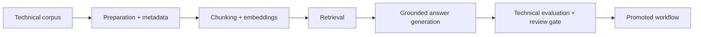

# 13. Industrial Document AI and Technical Knowledge Workflows on LUMI AI Factory

This lesson is the first domain accelerator module. It shows how to assemble a trustworthy technical document AI workflow on LUMI AI Factory using grounded retrieval, evidence-linked answers, and revision-aware operations.

## What This Lesson Enables

Build a reusable industrial document AI blueprint with:

- domain use-case definition
- revision-aware corpus and metadata pattern
- grounded retrieval-and-answer flow
- technical evaluation and review gates
- update ownership and promotion model

## When This Workflow Is Needed

Use this lesson when the customer has:

- technical manuals and operating procedures
- maintenance and troubleshooting knowledge bases
- engineering reports and internal technical documents
- tasks that require evidence-linked answers

Do not use this as a default for non-knowledge tasks or tasks where retrieval is unnecessary.

## What You Need Before Starting

- completion of Lessons 3, 4, and 8 (preferred: 10-12)
- a sample technical document corpus
- ability to use AI Factory software environment on LUMI

## Workflow At A Glance



## Minimal Worked Example

This lesson includes:

- [scenario](/Users/anisrahm/Documents/LUMI-AI-Guide/extension-track/13-industrial-document-ai/worked-example/scenario.md)
- [recommended architecture](/Users/anisrahm/Documents/LUMI-AI-Guide/extension-track/13-industrial-document-ai/worked-example/recommended-architecture.md)
- [corpus design](/Users/anisrahm/Documents/LUMI-AI-Guide/extension-track/13-industrial-document-ai/worked-example/corpus-design.md)
- [evaluation and review](/Users/anisrahm/Documents/LUMI-AI-Guide/extension-track/13-industrial-document-ai/worked-example/evaluation-and-review.md)

Core templates:

- [domain use-case brief](/Users/anisrahm/Documents/LUMI-AI-Guide/extension-track/13-industrial-document-ai/templates/domain-use-case-brief.md)
- [technical corpus schema](/Users/anisrahm/Documents/LUMI-AI-Guide/extension-track/13-industrial-document-ai/templates/technical-corpus-schema.md)
- [evaluation checklist](/Users/anisrahm/Documents/LUMI-AI-Guide/extension-track/13-industrial-document-ai/templates/evaluation-checklist.md)
- [update operating model](/Users/anisrahm/Documents/LUMI-AI-Guide/extension-track/13-industrial-document-ai/templates/update-operating-model.md)

Supporting assets:

- [answer schema cheat sheet](/Users/anisrahm/Documents/LUMI-AI-Guide/extension-track/13-industrial-document-ai/assets/answer-schema-cheatsheet.md)
- [document metadata cheat sheet](/Users/anisrahm/Documents/LUMI-AI-Guide/extension-track/13-industrial-document-ai/assets/document-metadata-cheatsheet.md)
- [revision handling note](/Users/anisrahm/Documents/LUMI-AI-Guide/extension-track/13-industrial-document-ai/assets/revision-handling-note.md)
- [port worksheet](/Users/anisrahm/Documents/LUMI-AI-Guide/extension-track/13-industrial-document-ai/assets/port-to-your-corpus-worksheet.md)

## How To Verify It Worked

A valid blueprint should show:

- one authoritative document source
- explicit document revision handling
- answer schema with evidence linkage
- unsupported-answer behavior defined
- update owner and promotion boundary defined

Optional validation:

```bash
python assets/validate_domain_blueprint.py \
  --use-case templates/domain-use-case-brief.md \
  --schema templates/technical-corpus-schema.md
```

## Corpus Design For Technical Documents

- preserve stable document IDs
- track revision and approval status per document
- separate procedure-like chunks from reference/manual chunks
- capture section context and document source metadata

## Grounded Answering And Trust Rules

- output must include evidence document and chunk references
- unsupported answers should fail safely with a review flag
- risky response classes require human review before delivery
- high fluency without evidence is not acceptable

## Evaluation For Technical Correctness

Use a compact scorecard:

- evidence relevance
- answer support by source text
- task correctness
- omission risk
- failure category

## Update And Lifecycle Model

- define owner for corpus updates
- define re-index/re-embed trigger conditions
- separate draft and promoted corpus states
- attach evaluation and review outcomes to promotions

## LUMI Platform Notes

- use AI Software Environment container lineage as default runtime
- run compute-heavy embedding/generation on LUMI-G
- use LUMI-O for staging and sharing corpus artifacts where needed
- treat DaaS as curated upstream input option when available

## Common Failure Modes

See [common-failures.md](/Users/anisrahm/Documents/LUMI-AI-Guide/extension-track/13-industrial-document-ai/troubleshooting/common-failures.md).

## Operational Checklist

- authoritative source identified
- revision state tracked
- evidence fields preserved in answer schema
- evaluation set and failure taxonomy defined
- unsupported-answer behavior defined
- update owner and promotion approver identified

## Next Lesson

Suggested next step: public-sector knowledge and policy assistant accelerator.
